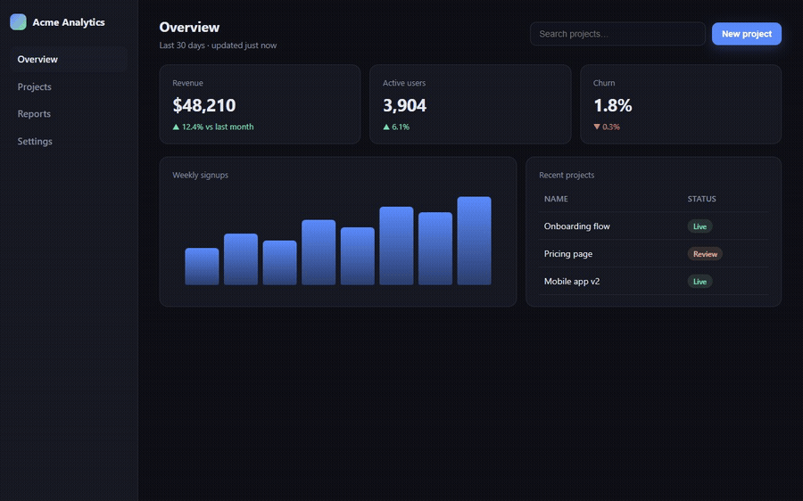

<h1 align="center">flowreel</h1>

<p align="center">
  <strong>Record a polished demo of your web app by describing it.</strong><br />
  One script. One command. A README GIF and an MP4 out.
</p>

<p align="center">
  
</p>

<p align="center">
  <em>This animation was recorded by flowreel. <a href="demo/demo.reel">Here is the script that made it.</a></em>
</p>

---

Every project needs a demo animation - for the README, the hackathon submission, the pull request, the launch post. Making one today means a screen recorder, a jerky real cursor, a 40&nbsp;MB file that breaks GitHub's size limit, and redoing the whole thing every time the UI changes.

flowreel replaces that with a short, readable script. It drives a real browser, draws a **synthetic cursor** that glides between targets, marks clicks with a **ripple**, shows what it typed in a **keystroke chip**, burns in **captions**, and can **zoom** or **highlight** so small text stays legible once your animation is scaled down to README width. Then it encodes the result under a byte budget so it actually fits where it's going.

- **No account, no API key, no server.** It runs on your machine and talks only to your app.
- **Uses the Chrome or Edge you already have.** No 150&nbsp;MB browser download on first run.
- **Re-runnable.** When your UI changes, regenerate the demo instead of re-recording it.
- **Errors tell you the fix**, not a stack trace. `Couldn't find "Sign in" on the page. Visible buttons: "Log in", "Register".`

## Quick start

```bash
npx flowreel demo.reel
```

With a `demo.reel` like this:

```
visit http://localhost:3000
viewport 1280x800
wait idle

caption "Sign in with one click"
click "Sign in"
wait 800

zoom "#dashboard"
caption "Your dashboard, ready to go"
wait 1200
reset zoom

caption ""
output demo
```

You get:

```
  demo.gif    1.8 MB   README, GitHub, npm
  demo.mp4    740 KB   X, docs sites, Product Hunt

  Paste into your README:
  
```

Requires Node 20+ and a Chrome or Edge install (or run `npx playwright install chromium` once).

## The `.reel` language

A script is one command per line. Targets are **visible text first** - `click "Sign in"` finds the button a human would click - with CSS selectors as the fallback when you need them. Lines starting with `#` are comments.

| command | what it does |
|---|---|
| `visit <url>` | open a page |
| `viewport <w>x<h>` | set the recording size, e.g. `1280x800` |
| `click <target>` | glide the cursor there, ripple, click |
| `type <target> "<text>"` | glide there and type it, with a keystroke chip |
| `press <key>` | press a key, e.g. `Enter` |
| `hover <target>` | glide there and hover |
| `scroll up\|down [px]` | scroll the page |
| `scroll to <target>` | scroll a target into view |
| `wait <ms>` | pause |
| `wait idle` | wait for network idle - use after `visit` on a dev server |
| `wait <target>` | wait for something to appear |
| `caption "<text>"` | burn in a caption; `caption ""` clears it |
| `zoom <target>` / `reset zoom` | zoom toward an element and back |
| `highlight <target>` / `reset highlight` | ring an element and dim the rest |
| `theme light\|dark` | emulate a color scheme |
| `output <name> [--preset <p>]` | write the files |

`output demo` writes the whole bundle for the preset. `output demo.gif` with an explicit extension writes just that one file.

## Presets

Say where the demo is going. flowreel picks the format, size and byte budget.

| preset | emits | fits |
|---|---|---|
| `default` | a README GIF **and** an MP4 | 5&nbsp;MB / 10&nbsp;MB |
| `github-readme` | GIF, 900px wide, looped | under 5&nbsp;MB |
| `docs` | WebM | under 10&nbsp;MB |
| `twitter` | MP4, 1280px wide | under 15&nbsp;MB |
| `producthunt` | GIF, 1270px wide | under 3&nbsp;MB |

If an output can't meet its budget, flowreel lowers the framerate, then the width, until it does - and still returns the file if it can't, rather than losing your recording over a few hundred kilobytes.

```bash
npx flowreel demo.reel --preset twitter   # the flag wins over the script's own output line
```

## Why a GIF?

Because it's the only format that autoplays inline in a GitHub README from a file in your own repo. MP4 and WebM have to be uploaded through GitHub's web editor, live outside your repository, and don't loop - which also means a CI job can't regenerate them. GIF is a bad format and flowreel treats it as one: palette-optimised, budgeted, and paired with an MP4 for everywhere else.

## Regenerating this README's demo

The animation at the top is produced by the tool itself, from [`demo/demo.reel`](demo/demo.reel) against [`demo/app.html`](demo/app.html):

```bash
npm run build
npm run demo
```

## Status

**v0.1 - early, working, and used to make its own README.** The scripting, capture, polish layer and encoder are complete and tested (140+ tests, run against a real browser and real ffmpeg). What's next:

- **`flowreel record`** - click through your app once and get the `.reel` script written for you. This is the headline feature and it's next.
- **Framing** - browser chrome, device frames, rounded corners and a backdrop.
- **A GitHub Action** that regenerates your demo on every release, so the README never shows a stale UI.
- **Animated WebP** for the README once its rendering on npm's package page is verified - it's ~5x smaller than GIF at full colour, and it already renders on GitHub.

Design notes and every decision taken along the way live in [`docs/`](docs/).

## Contributing

```bash
npm install
npm test          # runs the full suite, including browser and ffmpeg tests
npm run typecheck
```

Bug reports and pull requests are welcome. If a recording comes out wrong, the `.reel` script that produced it is the perfect reproduction - please include it.

## License

[MIT](LICENSE)
